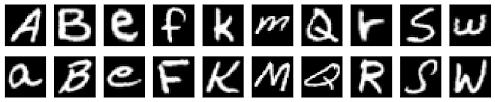
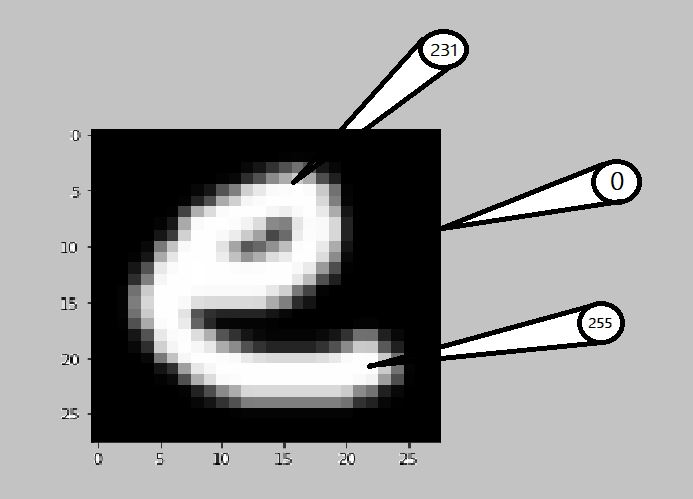

# Alphabet-Recognisation-Using-Hand-Gesture

## Overview
This is a simple app to predict the alphabet that is written on screen using an object-of-interest (a red pen). The Screen acts like a blackboard. Model is trained on the top of Keras API.

## Working Example


## Technical Aspects
The Project is divided into three parts:
1. Make a model using EMNIST Alphabet dataset using Keras to predict the alphabet.</br>
2. Take the reference of red colour to draw on the screen and using a deque to store the point of location where the red coloured object is moving and finally predicting the alphabet.
3. Adding a feature of sound (to speak the predicted alphabet). 
  
## YouTube Video(Explanation and demo)
[](http://www.youtube.com/watch?v=7YDiblwu_qE "Alphabet Recognition Using Hand Gestures")

## Code Requirements
The code is written in python 3.7. If you have a lower version of Python you can upgrade using the pip package, ensuring you have the latest version of pip.  

To install the required Packages and libraries, run this command in the project directory after cloning the repository.

```
pip install -r requirements.txt
```

## Data Description
The "Extended Hello World" of object recognition for machine learning and deep learning is the EMNIST dataset for handwritten letters recognition. It is an extended version of the MNIST dataset.


## Code Explanation 
I have written a tutorial <a href="https://helloml.org/alphabet-recognition-using-hand-gestures"> post on hello ML </a>explaining the code.


The small portion of the dataset is shown below.


Each of the letters is stored as a numbered array(28 x 28) as shown below.


 ## Code Execution
 After following the above steps of installation. Open the terminal( cmd, powershell ) in the project directory and use the command shown below.
 ```
 python Hand Gesture Implementation.py
 ```
 
 ## Contribute
 Feel free to contribute to this by creating an issue or a PR.
